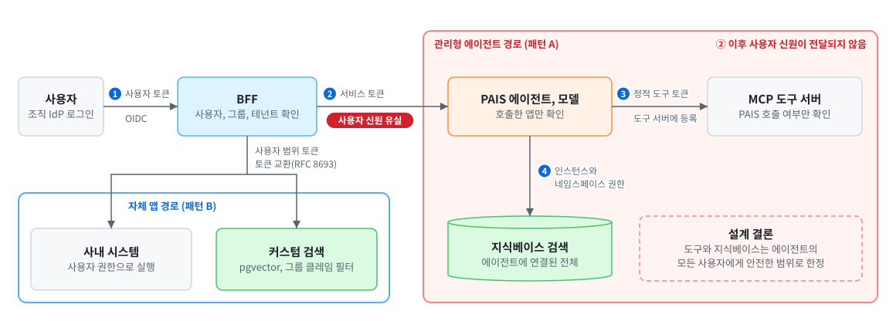

# 04 — 사용자 신원과 권한 전파

[← 목차로](../README.md)

서비스가 사용자를 대신해 지식베이스를 검색하고 사내 시스템에 접근하는 순간, "이 요청은 누구의 권한으로 실행되는가"가 설계에서 가장 먼저 답할 질문입니다. 이 문서는 사용자 신원이 앱에서 PAIS를 거쳐 도구와 지식베이스까지 어디까지 전달되는지, 어디서 유실되는지, 유실되는 지점에서 앱이 무엇을 대신해야 하는지를 규약으로 정합니다. 원칙은 [⑤ ID, 인증, 접근통제](https://github.com/JaeHoYun/vcf-private-ai/blob/main/05-security/docs/03-identity-access.md)가 정하고, 이 문서는 서비스 하나에 그 원칙을 적용하는 방법을 다룹니다.

> 본 문서의 수치와 동작은 VCF 9.1.1 / PAIF 9.1.1 / PAIS 3.0 기준입니다(작성 2026-09). PAIS가 호출 시 받은 사용자 컨텍스트를 도구와 검색까지 전파하는지는 공식 문서로 확인되지 않았으므로, 이 문서는 **전파되지 않는다고 가정하고** 앱이 강제하는 설계를 기본으로 채택합니다. 적용 전 최신 공식 문서로 재확인하시기 바랍니다.

---

## 4.1 두 층위의 신원

서비스 신원과 최종 사용자 신원은 다른 것이며, 섞으면 권한이 필요 이상으로 넓어집니다.

- **서비스 신원(앱 → PAIS).** 앱이 에이전트와 모델 엔드포인트를 호출할 때 사용하는 신원입니다. OIDC로 발급한 액세스 토큰(무인 클라이언트는 Client Credentials 그랜트)을 `Authorization: Bearer` 헤더로 보냅니다. PAIS 3.0부터는 계정이 직접 발급하는 **API 토큰**(`vcfa-<org>-...` 또는 `pais-<인증공급자>-...`)도 있으나, 사용자 신원을 담지 않는 장기 토큰이라 인스턴스 간 공유 모델 접근과 CLI 자동화에만 사용하고 일반 앱의 사용자 요청 경로에는 사용하지 않습니다([③ 05](https://github.com/JaeHoYun/vcf-private-ai/blob/main/03-serving-api/docs/05-auth-and-gateway.md)). UI로 PAIS를 활성화하면 API 토큰 발급이 기본으로 꺼져 있는 알려진 이슈가 있으니 첫 배포 때 확인하십시오.
- **최종 사용자 신원(사람).** 엔드포인트는 호출하는 서비스만 알 뿐, 그 서비스를 이용하는 실제 사람이 누구인지 모릅니다. 사용자 로그인, 사용자별 접근 권한, 테넌트 격리는 앱의 책임입니다.

PAIS의 접근 통제는 인스턴스 단위입니다. 인스턴스에 접근할 수 있는 계정은 그 안에 구성된 모든 것에 접근하며, 리소스 하위 집합으로 범위를 좁힐 수 없습니다([근거: PAIS 설계 라이브러리](https://techdocs.broadcom.com/us/en/vmware-cis/vcf/vcf-9-0-and-later/9-1/design/design-library/private-ai-platform-detailed-design/private-ai-services.html)). 따라서 최종 사용자 수천 명을 PAIS 계정으로 만들어 각자의 토큰으로 호출하게 하는 설계는 맞지 않습니다. 앱이 서비스 신원으로 PAIS를 호출하고, 사용자 신원은 앱이 별도 채널로 전달합니다.

**실구성 사례(공개).** PAIS 배포에는 Authorization Code + PKCE 흐름을 지원하는 OIDC 공급자가 필요합니다. 클라이언트 생성(PKCE S256), 리다이렉트 URL, 그룹과 오디언스 매퍼 설정과 액세스 토큰 발급 스크립트까지 다루는 공개 구성 글이 두 건 있습니다: [Keycloak(VCF Infrastructure Services Appliance 내장) 구성, williamlam.com 2026-08](https://williamlam.com/2026/08/configuring-oidc-with-pkce-in-keycloak-for-vcf-private-ai-services.html), [Authentik 구성, williamlam.com 2025-09](https://williamlam.com/2025/09/ms-a2-vcf-9-0-lab-configuring-authentik-identity-provider-vmware-for-private-ai-services-pais.html).

## 4.2 전파 경로. 어디서 무엇이 유실되나

사용자 요청은 네 경계를 거칩니다. 경계마다 신원이 무엇으로 표현되는지가 다르고, 두 번째 경계에서 사용자 신원은 기본적으로 유실됩니다.

<picture>
  <source media="(prefers-color-scheme: dark)" srcset="../assets/identity-propagation-boundaries-dark.svg">
  
</picture>

| 경계 | 신원의 표현 | 무엇이 보존되나 | 무엇이 유실되나 |
|------|-------------|-----------------|---------------|
| ① 사용자 → BFF | 조직 IdP가 발급한 사용자 토큰(OIDC) | 사용자, 그룹, 테넌트 | — |
| ② BFF → PAIS | 서비스 토큰(Client Credentials) | 서비스 신원 | **사용자 신원**. PAIS는 어느 앱이 불렀는지만 안다 |
| ③ PAIS → MCP 도구 | 도구 서버에 등록한 정적 인증 토큰([09 9.5절](09-mcp-tools.md)) | 도구 서버가 아는 것은 "PAIS가 불렀다"뿐 | 사용자와 서비스 신원 모두 |
| ④ PAIS → 지식베이스 | 인스턴스와 네임스페이스 권한 | 에이전트에 연결된 지식베이스 전체 | 사용자별 문서 권한 |

이 표에서 설계의 핵심 결론이 도출됩니다. **관리형 에이전트가 부르는 도구와 지식베이스는 그 에이전트의 모든 사용자에게 안전해야 합니다.** 도구 서버가 받는 것은 정적 토큰 하나이므로 도구 쪽에서 사용자별로 권한을 나눌 근거가 없고, 지식베이스는 에이전트 단위로 전체 접근이 허용됩니다. 모델이 프롬프트에서 사용자 ID를 읽어 도구 인자로 넘기는 방식은 프롬프트 인젝션으로 바꿔치기할 수 있으므로 권한 근거로 사용하지 않습니다.

## 4.3 세 가지 전파 패턴

| 패턴 | 사용자 권한이 강제되는 지점 | 언제 |
|------|------------------------------|------|
| **A. 관리형 에이전트 + 서비스 범위 도구** | BFF(진입점)에서만. 에이전트가 호출하는 도구와 지식베이스는 서비스 범위로 설계 | 도구가 읽기 전용이고 그 데이터를 에이전트 사용자 전원이 조회해도 되는 경우. 사용자 집단이 다르면 에이전트나 네임스페이스를 분리 |
| **B. 자체 앱 오케스트레이션 + 사용자 범위 토큰** | 앱이 도구와 검색을 직접 호출하며 사용자 범위 토큰으로 강제 | 사용자마다 볼 수 있는 데이터와 할 수 있는 행동이 다른 경우. 사내 시스템 쓰기, 개인 데이터 조회 |
| **C. 하이브리드** | 관리형 에이전트는 공용 지식 검색과 초안 생성만, 사용자 범위 행동은 앱이 실행 | 사례 B의 운영 알림 진단처럼 조회는 넓고 행동은 사람이 직접 수행하는 경우([02 2.7절](02-use-cases.md)) |

**패턴 A의 규율.** 에이전트에 연결하는 도구는 "이 에이전트의 사용자 누구에게 노출돼도 되는가"를 기준으로 고릅니다. 도구 서버의 자격증명은 최소 권한이며, 읽기 전용이 기본입니다. 사용자 집단(부서, 등급, 테넌트)이 다르면 **에이전트를 나누고 지식베이스와 도구 집합을 따로** 구성합니다. PAIS의 경계는 인스턴스와 네임스페이스이므로 데이터 경계가 다르면 인스턴스를 분리하라는 설계 라이브러리의 권고와 같은 말입니다. BFF는 사용자가 그 에이전트를 사용할 자격이 있는지를 진입 시점에 검사합니다.

**패턴 B의 규율.** 앱이 모델 엔드포인트(OpenAI 호환)만 PAIS에서 소비하고([03 3.6절](03-design-patterns.md)), 도구 호출과 검색은 앱 안에서 실행합니다. 이때 사용자 범위를 강제하는 표준 수단이 **토큰 교환(OAuth 2.0 Token Exchange, RFC 8693)** 입니다. BFF가 사용자 토큰(subject token)과 자기 자격증명을 인가 서버에 제시하면, 대상 시스템용 audience와 scope를 가진 새 토큰을 받습니다. 두 방식이 있습니다.

- **위임(delegation).** 새 토큰의 주체는 사용자이고 `act` 클레임에 BFF(그리고 필요하면 에이전트)가 행위자로 기록됩니다. 대상 시스템은 "사용자를 대신해 BFF가 호출했다"를 알 수 있어 감사 추적이 남습니다. 기본으로 권합니다.
- **가장(impersonation).** 새 토큰이 사용자와 구별되지 않습니다. 대상 시스템이 행위자를 구분할 수 없으므로, 레거시가 위임을 지원하지 않을 때만 예외적으로 사용합니다.

인가 서버가 토큰 교환을 지원하지 않으면, 차선책은 BFF가 서명한 사용자 컨텍스트 헤더(사용자 ID, 그룹, 테넌트, 요청 ID)를 사내 API로 전달하고 사내 API가 그 서명을 검증하는 방식입니다. 서명이 없는 헤더는 누구나 위조할 수 있으므로 권한 근거로 사용하면 안 됩니다. VKS 3.7의 Workload Identity Federation을 사용하면 앱 워크로드의 신원을 외부 인가 서버가 검증할 수 있어 정적 시크릿 대신 워크로드 신원으로 교환을 시작할 수 있습니다([⑤ 03 3.2절](https://github.com/JaeHoYun/vcf-private-ai/blob/main/05-security/docs/03-identity-access.md)).

## 4.4 MCP 도구 단의 신원

PAIS가 MCP 서버에 연결할 때 사용하는 인증은 정적 인증 토큰 헤더입니다([09 9.5절](09-mcp-tools.md)). 즉 관리형 에이전트 경로에서 도구 서버는 사용자별 토큰을 받지 못하며, 이것이 4.3절 패턴 A의 제약입니다. 사내 MCP 서버를 만들 때 지킬 규칙은 다음과 같습니다.

- **도구 서버의 자격증명은 서비스 범위로 최소화.** 도구 서버가 연결된 사내 시스템에 접근할 때 사용하는 계정은 그 도구의 목적에 필요한 최소 권한만 갖습니다. "넓은 관리자 계정 하나로 모든 도구를 운영하는" 구성은 한 도구의 오용이 전 시스템으로 확산됩니다.
- **쓰기 도구는 관리형 에이전트에 직접 노출하지 않음.** 사용자별 권한이 필요한 쓰기 행동은 앱이 승인 게이트를 거쳐 실행합니다([07](07-integration-write-design.md)).
- **MCP 인가 사양의 방향.** MCP 사양은 2025-06 개정판부터 OAuth 2.1과 리소스 지시자(RFC 8707)와 보호 자원 메타데이터(RFC 9728)를 인가 기반으로 정했고, 2026-07-28 개정판은 발급자 검증(RFC 9207)을 요구하며 동적 클라이언트 등록을 폐기 예고했습니다([MCP 2026-07-28 변경 사항](https://modelcontextprotocol.io/specification/2026-07-28/changelog)). OAuth로 보호한 MCP 서버를 사용자 범위로 호출하는 것은 현재 자체 앱 경로(패턴 B)에서만 성립합니다. PAIS가 사용자 컨텍스트나 OAuth 흐름을 도구 호출에 포함해 전달하면 이 절을 갱신합니다.
- **도구 서버의 감사 로그.** 도구 서버는 호출자(PAIS 인스턴스와 네임스페이스), 시각, 도구, 인자(민감정보 마스킹), 결과, 요청 ID를 남깁니다. 관리형 경로에서는 사용자 ID가 도구 서버까지 전달되지 않으므로, BFF의 요청 ID를 에이전트 세션과 도구 호출 로그에 같이 남겨 사후에 연결합니다(4.7절).

## 4.5 지식베이스 권한 일치

원본 데이터 소스의 접근 권한과 지식베이스 소비 권한이 일치하지 않으면, 에이전트를 통해 권한 없는 사용자가 민감 문서를 우회 열람합니다([⑤ 03 3.4절](https://github.com/JaeHoYun/vcf-private-ai/blob/main/05-security/docs/03-identity-access.md)). 두 경로가 있습니다.

| 경로 | 권한을 맞추는 방법 | 한계 |
|------|--------------------|------|
| **PAIS 관리형 지식베이스** | 지식베이스 하나를 "같은 권한을 가진 사용자 집단" 단위로 만들고, 에이전트와 네임스페이스를 그 집단에 맞춰 분리 | 지식베이스 안에서 문서 단위로 사용자별 필터를 적용하는 기능은 공식 문서에서 확인되지 않음. 집단이 세분화될수록 지식베이스와 에이전트 수가 늘어남 |
| **커스텀 pgvector 검색(자체 앱 경로)** | 청크마다 접근 허용 주체(`acl_principals`)와 분류 등급을 메타데이터로 저장하고, 쿼리 시 사용자 토큰의 그룹 클레임으로 사전 필터. 기본값은 거부 | 인입 파이프라인과 권한 재동기화를 앱 팀이 운영 |

두 경로의 공통 규칙은 "검색 계층이 사용자를 추측하지 않는다"입니다. 필터 조건은 BFF가 검증한 인증 컨텍스트에서 서버 측이 주입하며, 클라이언트가 보낸 권한 값은 신뢰하지 않습니다([⑤ 05 5.3절](https://github.com/JaeHoYun/vcf-private-ai/blob/main/05-security/docs/05-data-governance.md)). 데이터 소스를 지식베이스에 인입하는 절차와 보호 문서의 처리는 설계 편의 데이터 소스 온보딩에서 이어 다룹니다.

## 4.6 긴 실행과 재인증

사용자 액세스 토큰의 수명은 보통 분 단위에서 1시간이고, 다단계 에이전트 실행이나 배치는 그보다 길어질 수 있습니다.

- **관리형 경로.** BFF와 PAIS 사이는 서비스 토큰이므로 사용자 토큰 만료와 무관합니다. 다만 BFF는 응답을 사용자에게 반환할 때 사용자 세션이 아직 유효한지 다시 확인합니다.
- **자체 앱 경로.** 사용자 범위 토큰으로 사내 시스템을 부르는 단계는 토큰 만료 전에 끝나야 합니다. 오래 걸리는 작업은 사용자 토큰을 캐시해 두는 대신, 작업 시작 시점에 필요한 하위 토큰을 교환해 두고 만료되면 사용자 재인증을 요구하거나 작업을 대기 상태로 전환합니다. 사용자가 없는 배치 작업은 처음부터 서비스 신원으로 설계하고 사용자 대리 실행을 시도하지 않습니다.
- **세션 저장소.** 에이전트 세션이나 앱 세션에 사용자 토큰 원문을 저장하지 않습니다. 저장하는 것은 사용자 ID와 그룹 같은 컨텍스트이며, 토큰은 요청마다 다시 받습니다.

## 4.7 감사 로그에 남길 것

사용자 신원이 경계마다 다른 형태로 표현되므로, 사후에 "누가 무엇을 시켰고 무엇이 실행됐는가"를 연결하려면 각 층의 로그가 같은 식별자를 공유해야 합니다.

| 필드 | 값 | 어디서 남기나 |
|------|----|---------------|
| 요청 ID | BFF가 요청마다 생성해 모든 하위 호출에 전달 | BFF, 앱, 에이전트 세션, 도구 서버 |
| 사용자 | 사용자 ID, 그룹, 테넌트 | BFF, 앱 |
| 행위자 | 서비스 신원, 에이전트 ID, 토큰 교환 시 `act` 체인 | 앱, 대상 시스템 |
| 행동 | 호출한 도구와 인자(민감정보 마스킹), 검색한 지식베이스와 필터 | 앱 또는 PAIS 추적([14 14.2절](14-operations.md)) |
| 승인 | 승인자, 시각, 승인 대상 | 앱의 승인 큐([07](07-integration-write-design.md)) |

PAIS 3.0의 LLM 상호작용 추적은 세션과 도구 호출을 OpenTelemetry로 남기므로, BFF가 만든 요청 ID를 추적 컨텍스트에 포함해 전달하면 사용자 로그와 플랫폼 추적을 하나의 식별자로 연결할 수 있습니다. 로그 항목의 최소 기준은 [⑤ 07 7.1.2절](https://github.com/JaeHoYun/vcf-private-ai/blob/main/05-security/docs/07-audit-compliance.md)을 따릅니다.

## 4.8 확인 사항과 결정 기록

서비스를 설계할 때 다음을 확인하고 결정 기록에 남깁니다.

1. 이 서비스의 사용자 집단은 하나인가, 여럿인가. 여럿이면 에이전트와 지식베이스를 어떻게 나누는가.
2. 사용자마다 볼 수 있는 데이터가 다른가. 다르면 패턴 B 또는 C이며, 커스텀 검색 경로가 필요한가.
3. 사용자마다 할 수 있는 행동이 다른가. 다르면 쓰기 행동은 앱이 사용자 범위 토큰으로 실행한다.
4. 인가 서버가 토큰 교환을 지원하는가. 지원하지 않으면 서명된 컨텍스트 헤더로 대체하고 그 한계를 기록한다.
5. PAIS가 사용자 컨텍스트를 도구와 검색까지 전파하는지 공식 문서로 확인했는가. 확인 전에는 전파되지 않는다고 가정한다.

결정 기록은 신원 전파 계약으로 운영합니다. 4.2절의 네 경계와 4.6절의 긴 실행을 한 행씩 나누고, 행마다 전달되는 신원, 토큰 또는 수단, 검증 주체, 감사 필드(4.7절)를 적습니다. 운영 기준은 다음과 같습니다.

- **판정 기준(필수).** 사용자마다 볼 수 있는 데이터나 할 수 있는 행동이 다르면 패턴 B 또는 C여야 합니다. 모델이 생성한 사용자 ID와 서명 없는 헤더는 어느 경계에서도 권한 근거로 사용하지 않습니다. MCP 서버의 정적 토큰은 서비스 전용이며 다른 서비스와 공유하지 않습니다. 요청 ID는 네 경계의 로그에 모두 남아야 합니다.
- **판정 기준(권장).** 토큰 교환은 위임 방식을 사용하고, 가장 방식을 사용한 경계는 그 이유를 적습니다. 서명된 컨텍스트 헤더로 대체했다면 서명 키의 관리 주체와 교체 주기를 함께 적습니다.
- **누가 언제.** 앱 팀의 아키텍트가 설계 단계에서 작성하고, 보안팀이 파일럿 게이트([12 12.7절](12-service-security.md)) 전에 검토합니다. 이 기록은 출시 심사 패키지의 신원과 권한 항목([13 13.10절](13-evaluation-guardrails.md))으로 제출됩니다. 역할 정의는 [⑦ 09 9.2절](https://github.com/JaeHoYun/vcf-private-ai/blob/main/07-design/docs/09-roles-raci.md#92-수명주기-raci)을 따릅니다.
- **어떻게 측정하나.** 표본 요청을 요청 ID 하나로 앱, PAIS 추적, 도구 서버 로그까지 재구성하는 시험을 실행하고, 재구성에 성공한 비율을 측정합니다. 검색 권한은 권한이 없는 시험 사용자로 민감 문서를 질의해 반환 건수가 0인지 확인합니다.
- **어떻게 개선하나.** 사용자 집단 추가, 쓰기 도구 추가, 인가 서버 교체나 토큰 교환 지원 여부 변경, PAIS 릴리스에서 사용자 컨텍스트 전파가 공식 문서로 확인되는 경우에 계약을 다시 작성합니다.

---
[← 이전: 03 에이전트 설계 패턴](03-design-patterns.md) | [목차](../README.md) | [다음: 05 플랫폼 소비: 게이트웨이, 온보딩, 쿼터와 토큰 예산 →](05-platform-consumption.md)
