# 06 — 데이터 소스 온보딩과 보호 문서

[← 목차로](../README.md)

서비스가 답의 근거로 삼을 문서를 지식베이스에 들이는 일은 기술 작업이기 전에 승인 작업입니다. 어느 저장소의 어느 문서를, 누구의 승인으로, 어떤 조건 아래 들이는가가 먼저이고, 파이프라인은 그 결정을 집행합니다. 이 문서는 데이터 소스 온보딩의 절차를 정하고, 그중 가장 자주 막히는 질문 — 문서보안(DRM)으로 암호화된 문서를 어떻게 검색 결합(RAG)의 소스로 쓰는가 — 를 특정 제품에 기대지 않는 상위 아키텍처와 워크플로로 답합니다. 파이프라인의 기술 상세(추출, 청킹, 임베딩, 적재)는 [④ RAG](https://github.com/JaeHoYun/vcf-private-ai/tree/main/04-rag)가, 파생 데이터의 거버넌스는 [⑤ 05](https://github.com/JaeHoYun/vcf-private-ai/blob/main/05-security/docs/05-data-governance.md)가 정본입니다.

> 본 문서의 수치와 동작은 VCF 9.1.1 / PAIF 9.1.1 / PAIS 3.0 기준입니다(작성 2026-09). PAIS Data Indexing and Retrieval이 지식베이스 안에서 문서 단위로 사용자별 권한 필터를 거는지는 공식 문서로 확인되지 않았으므로, 이 문서는 지식베이스와 인스턴스 분리를 기본 경계로 둡니다. 문서보안 제품의 규격과 API는 제품마다 다르므로 다루지 않습니다. 적용 전 최신 공식 문서와 조직의 문서보안 정책으로 재확인하시기 바랍니다.

---

## 6.1 질문의 재정의 — 복호화가 아니라 파생 사본이 문제다

"보호 문서를 복호화해서 지식베이스에 넣어도 되는가"라는 질문에는 세 가지 오해가 섞여 있습니다.

- **금지된 일이 아닙니다.** 규제와 보안 관행 어디에도 문서보안이 걸린 문서의 서버 측 복호화를 금지하는 조항은 없습니다. 검색엔진 인덱서, 비즈니스 인텔리전스 도구, 데이터 유출 방지 솔루션, 백업 시스템은 오래전부터 "권한을 가진 가상 사용자"로 문서보안 서버와 통신해 암호문을 읽어 왔습니다. 검색 결합은 그 연장선입니다.
- **다른 점은 파생 사본의 양과 출력의 성격입니다.** 검색 결합은 원문에서 청크, 임베딩, 검색 캐시, 프롬프트 로그, 추적 데이터라는 파생 사본을 여럿 만들고, 그 사본을 근거로 생성형 답을 내놓습니다. 문서보안이 지키려던 것은 "원문이 통제 밖으로 나가지 않는 것"이므로, 진짜 질문은 **"파생 사본을 원문과 같은 등급으로 통제할 수 있는가"** 입니다.
- **복호화는 파이프라인의 한 단계이지 끝이 아닙니다.** 권한은 검색 시점에 다시 강제되어야 하고([04 4.5절](04-identity-propagation.md)), 권한 회수와 등급 변경이 인덱스에 전파되어야 합니다.

용어도 먼저 정합니다. 이 문서의 서비스는 **조회 전용**입니다. 보호 문서를 파인튜닝 데이터로 쓰는 것은 별도 심의 사항이며, 유스케이스 문서와 데이터 오너 승인서에 조회 전용임을 명시합니다([02 2.11절](02-use-cases.md)).

## 6.2 설계 원칙 여섯 가지

1. **파생 사본은 원문 등급을 상속합니다.** 청크, 임베딩, 캐시, 세션 로그, 추적 데이터, 백업은 원문의 분류 등급과 접근 주체를 그대로 물려받고 정보자산 대장에 등록합니다. 임베딩만으로 원문의 상당 부분을 복원할 수 있다는 연구가 있으므로 벡터 저장소는 캐시가 아니라 원문 등급 자산입니다([⑤ 05 5.5절](https://github.com/JaeHoYun/vcf-private-ai/blob/main/05-security/docs/05-data-governance.md)).
2. **선별해서 들입니다.** 등급, 저장소, 유스케이스로 범위를 정합니다. 전사 문서를 일괄 복호화하지 않습니다(6.3절).
3. **인덱서는 권한을 가진 가상 사용자입니다.** 복호화 서비스 신원은 문서보안 시스템에 전용 계정과 허용 프로세스로 등록하고, 문서 단위 권한 확인을 켠 채 복호화합니다. 사람 계정을 빌려 쓰지 않습니다.
4. **평문은 격리 존 밖으로 나가지 않습니다.** 복호화, 정규화, 마스킹, 청킹, 임베딩, 스테이징까지가 한 존입니다. 존 밖으로 나가는 것은 등급과 접근 주체가 붙은 청크와 벡터뿐이며, 그것도 등급별로 분리된 저장소로만 갑니다.
5. **권한은 검색 시점에 다시 강제합니다.** 인덱싱 때 붙인 접근 주체로 쿼리 시 사전 필터하고 기본값은 거부입니다. 회수와 재분류 이벤트는 청크를 즉시 비활성화합니다. 시스템 프롬프트로 접근통제를 대신하지 않습니다.
6. **조회 전용입니다.** 파인튜닝에는 쓰지 않습니다.

## 6.3 범위 결정 — "전부 복호화"가 답이 아닌 이유와 절차

전사 문서를 통째로 들이지 않는 이유는 다섯 가지입니다. 위험 표면이 문서 수에 비례해 커집니다. 저장과 임베딩 비용이 원문의 여러 배로 늘어납니다(PAIS 설계 문서는 pgvector가 원문 청크와 메타데이터까지 저장하므로 디스크를 원문의 5배에서 10배로 잡으라고 안내합니다). 중복과 폐기 대상 문서가 인덱스 품질을 떨어뜨립니다. 접근 주체 동기화 부담이 저장소 수에 비례합니다. 그리고 문서보안 시스템의 감사 체계에서 대량 배치 복호화는 그 자체로 이상행위 패턴이라, 서비스 계정을 별도 정책으로 등록하지 않으면 운영 첫날부터 경보가 쏟아집니다.

범위는 네 단계로 정합니다.

1. **인벤토리** — 저장소별 소유 부서, 문서 수, 등급 분포, 접근 주체 체계, 문서보안 적용 여부를 실측합니다. 양식은 [⑦ 워크시트 03 AI 자산 현황 인벤토리](https://github.com/JaeHoYun/vcf-private-ai/blob/main/07-design/worksheet/03-ai-estate-inventory.md)의 블록 3(데이터와 지식)입니다. 세기 전에 결정하지 않는다는 전사 방법론의 원칙([AX 01 1.4절](https://github.com/JaeHoYun/enterprise-ax-methodology/blob/main/docs/01-starting-point.md))을 데이터에 적용한 단계입니다.
2. **등급 라벨 확보** — 문서에 등급 라벨이 붙어 있어야 인덱싱 정책과 청크 메타데이터로 이어집니다. 라벨이 없는 저장소는 분류가 선행 과제이며, 그 전까지는 인덱싱 대상이 아닙니다.
3. **유스케이스 기반 우선순위** — 첫 서비스가 실제로 읽는 저장소 서너 곳부터 시작합니다. 소유자와 접근 주체가 명확한 문서관리시스템, 협업 포털, 파일 서버가 먼저이고, 개인 PC와 그룹웨어 첨부처럼 소유와 권한이 흐린 곳은 중앙 저장소로 모은 뒤에 대상에 넣습니다. 중복과 폐기 대상은 먼저 걸러냅니다.
4. **오너 승인과 등급별 처리** — 저장소 소유 부서가 인덱싱 범위(등급, 폴더, 기간)를 서면으로 승인합니다. 등급별 처리는 다음 표를 기본값으로 둡니다.

| 등급([⑤ 05 5.1절](https://github.com/JaeHoYun/vcf-private-ai/blob/main/05-security/docs/05-data-governance.md)의 4단계) | 처리 |
|---|---|
| 공개, 내부 | 인덱싱 기본 대상. 접근 주체 메타데이터는 그래도 붙입니다 |
| 기밀 | 데이터 오너가 승인한 범위만. 격리된 지식베이스나 인스턴스에 두고, 필요하면 쿼리 시 복호화 패턴(6.5절)을 적용 |
| 제한, 국가핵심기술, 최상위 민감 | 인덱싱 제외. 꼭 필요하면 제목과 요약과 태그만 인덱싱하고 본문은 문서보안 뷰어에서 사용자 권한으로 열람(포인터 반환). 최상위 키 보호 문서는 인덱싱과 어시스턴트에서 아예 제외하고, 그 보호는 전체 문서의 소수에만 적용하는 것이 통상의 설계 권고입니다 |

## 6.4 전체 구성 밑그림 — 여섯 개 존

```mermaid
flowchart LR
    subgraph SRC["존 1: 분산 소스 저장소"]
        S1["문서관리시스템, 협업 포털"]
        S2["파일 서버, NAS"]
        S3["그룹웨어 첨부, 개인 PC<br/>(중앙화 뒤에 대상)"]
    end
    subgraph COL["존 2: 수집"]
        C1["크롤러와 커넥터<br/>변경 감지, 중복 제거, 버전"]
    end
    subgraph DEC["존 3: 복호화 전처리 (격리)"]
        D1["복호화 워커<br/>서비스 신원, 문서 단위 권한 확인"]
        D2["문서보안 서버와 키 서버 연동"]
        D3["정규화, 형식 변환, OCR<br/>PII 마스킹, 청킹, 접근 주체 평탄화"]
        D4["스테이징 (S3 호환)"]
    end
    subgraph IDX["존 4: 인덱스 저장 (등급별 분리)"]
        I1["PAIS Data Indexing<br/>(지식베이스와 인스턴스 = 경계)"]
        I2["커스텀 pgvector<br/>(문서 단위 접근 주체 필터)"]
    end
    subgraph QRY["존 5: 쿼리와 출력"]
        Q1["사용자 그룹 클레임으로 사전 필터"]
        Q2["출력 통제: 등급 표시, 복사 차단,<br/>마스킹, 유출 방지"]
    end
    subgraph AUD["존 6: 감사와 수명주기"]
        A1["복호화 로그 + 검색 로그 + LLM 추적 → 중앙 수집"]
        A2["회수와 재분류 이벤트 → 청크 즉시 비활성화"]
    end
    SRC --> COL --> DEC --> IDX --> QRY
    DEC -.-> AUD
    IDX -.-> AUD
    QRY -.-> AUD
```

| 존 | 무엇이 있나 | VCF 배치 | 정본 |
|----|-------------|----------|------|
| 1 소스 | 문서가 실제로 있는 저장소. 소유자와 접근 주체가 명확한 곳부터 | 기존 시스템 | 6.3절 |
| 2 수집 | 변경 감지 커서, 중복 제거, 버전 관리를 갖춘 커넥터 | 존 3과 같은 네임스페이스 | [④ 02 2.1.1절과 2.5절](https://github.com/JaeHoYun/vcf-private-ai/blob/main/04-rag/docs/02-ingestion-indexing.md) |
| 3 복호화 전처리 | 서비스 신원으로 문서 단위 권한을 확인하며 복호화하고, 정규화와 형식 변환과 OCR과 마스킹과 청킹을 거쳐 접근 주체를 평탄화한 뒤 S3 호환 스테이징에 둠 | 별도 VKS 클러스터나 네임스페이스. NSX 분산 방화벽으로 문서보안 서버, 키 서버, 스테이징, 존 4 외의 통신 차단. 평문은 이 존을 나가지 않음 | [④ 02 2.1.2절](https://github.com/JaeHoYun/vcf-private-ai/blob/main/04-rag/docs/02-ingestion-indexing.md), [⑦ 05 5.4절](https://github.com/JaeHoYun/vcf-private-ai/blob/main/07-design/docs/05-tenancy-security.md) |
| 4 인덱스 저장 | 관리형 지식베이스(S3 호환 커넥터로 스테이징을 읽음) 또는 커스텀 pgvector. 등급별로 지식베이스와 인스턴스와 DB를 분리 | vSAN 암호화 스토리지 위의 DSM PostgreSQL. 등급별 인스턴스 | [② 05 5.3절](https://github.com/JaeHoYun/vcf-private-ai/blob/main/02-vectordb/docs/05-usage-rag.md), [⑤ 05 5.2절](https://github.com/JaeHoYun/vcf-private-ai/blob/main/05-security/docs/05-data-governance.md) |
| 5 쿼리와 출력 | 사용자 토큰의 그룹 클레임으로 사전 필터, 필요 시 문서보안 서버에 실시간 재검증. 출력에 등급 표시, 복사와 공유 차단, 개인정보 마스킹 | 앱과 BFF | [04 4.5절](04-identity-propagation.md), 구축 편의 앱 통합과 신뢰 UX |
| 6 감사와 수명주기 | 복호화 로그(서비스 계정, 문서, 승인 근거, 건수), 검색 로그, LLM 추적을 문서 ID로 이어 중앙 수집. 회수와 재분류 이벤트로 청크 즉시 비활성화 | 중앙 로그 수집, 로그 저장소는 원문 등급 자산 | [⑤ 07 7.1.2절](https://github.com/JaeHoYun/vcf-private-ai/blob/main/05-security/docs/07-audit-compliance.md), [⑤ 05 5.9절](https://github.com/JaeHoYun/vcf-private-ai/blob/main/05-security/docs/05-data-governance.md) |

존 6의 로그 저장소는 곧 "복호화된 발췌본의 저장소"입니다. 프롬프트와 완성문을 그대로 남기는 추적은 원문 등급 자산으로 등록하고 보존과 접근권한을 정합니다.

## 6.5 인입 패턴 다섯 가지와 권장 조합

| 패턴 | 동작 | 장점 | 단점 | 적합 등급 |
|------|------|------|------|-----------|
| (1) 인제스트 시 복호화, 파생 사본 재보호, 접근 주체 메타데이터 전파 | 격리 존에서 복호화하고 청크와 임베딩에 등급과 접근 주체를 붙여 저장, 쿼리 시 사용자 그룹으로 필터 | 답 품질과 지연이 가장 좋고, 라벨을 청크 단위로 투영하고 인덱서에만 권한을 주며 쿼리 시 사용자 권한으로 필터하고 상승 조회를 문서마다 감사하는 구조로 널리 쓰이는 방식 | 평문 청크와 임베딩이 저장소에 상주. 권한 변경 반영이 인덱서 주기에 종속 | 공개, 내부, 승인된 기밀 일부 |
| (2) 쿼리 시 복호화(late binding) | 임베딩은 생성하되 청크 본문은 암호화해 저장, 검색 뒤 사용자 권한으로 복호화해 프롬프트 조립 | 파생 사본 최소, 회수 즉시 반영 | 임베딩 생성에는 여전히 평문이 필요, 지연 증가, 구현 복잡 | 기밀 |
| (3) 메타데이터만 인덱싱, 포인터 반환 | 제목과 요약과 태그만 인덱싱, 본문은 문서보안 뷰어에서 사용자 권한으로 열람 | 본문 사본 없음 | 답이 "어디에 있는지"에 그침 | 제한, 국가핵심기술 |
| (4) 등급별 선별 인덱싱 | 공개와 내부와 승인된 기밀만, 제한은 제외 | 범위 통제가 명확 | 분류 정확도에 의존 | 모든 조직의 1차 기본값 |
| (5) 집단별 격리 인덱스 | 부서나 데이터 경계마다 지식베이스와 인스턴스를 분리 | 인스턴스가 곧 경계라 문서 단위 필터 없이도 성립 | 지식베이스 수 증가, 교차 부서 질의 불가 | 기밀 |

권장 조합은 (4)를 전제로 (1)과 (5)를 결합하고, 특정 기밀 저장소에 (2)를, 제한 등급에 (3)을 적용하는 것입니다.

**관리형 대 커스텀 판정** — 기준은 하나입니다. **지식베이스 하나 안에서 문서 단위로 사용자별 필터가 필요한가.** 필요하면 커스텀 pgvector 경로(청크 메타데이터 필터, [④ 02](https://github.com/JaeHoYun/vcf-private-ai/blob/main/04-rag/docs/02-ingestion-indexing.md))이고, 아니면 관리형 지식베이스를 사용자 집단 단위로 나누는 패턴 (5)로 충분합니다. 관리형 경로를 쓸 때 복호화 전처리 존은 결과를 S3 호환 스테이징에 두고 PAIS의 S3 커넥터가 읽게 하는 것이 자연스러운 접점입니다. 커넥터는 평문만 읽으므로 문서보안 문서를 저장소에서 직접 연결할 수는 없습니다([② 05 5.3절](https://github.com/JaeHoYun/vcf-private-ai/blob/main/02-vectordb/docs/05-usage-rag.md)). 어느 경로든 접근 주체는 문서보안 정책(사용자, 부서, 직급, 등급, 유효기간의 조합)을 인덱싱 시점에 "허용 그룹 목록"으로 평탄화하고, 조직 디렉터리의 그룹이나 OIDC 그룹 클레임과 매핑합니다. 평탄화 결과가 비어 있으면 제한으로 처리합니다.

## 6.6 조직 워크플로 — 승인 체인과 운영 루프

**승인 체인**

| 단계 | 누가 | 무엇을 |
|------|------|--------|
| 1 | 데이터 오너(저장소 소유 부서) | 인덱싱 범위(등급, 폴더, 기간)를 서면 승인하고 회수 권한을 보유 |
| 2 | 보안팀(문서보안 운영) | 정책 예외를 등록: 복호화 서비스 계정, 허용 프로세스, 문서 단위 권한 확인 활성화, 대량 복호화 임계치를 별도 정책으로 승인해 이상행위 경보와 분리, 예외 폴더 |
| 3 | 정보보호위원회 | 복호화 서비스 도입, 파생 데이터의 등급, 로그 보존을 안건으로 심의. 금융권은 반기 보안통제 평가에 포함 |
| 4 | 개인정보 담당 | 영향평가(대규모나 민감한 개인정보 처리 시) 수행, 사내 개인정보의 추가 이용 근거 문서화, 처리방침과 이용 안내 반영 |
| 5 | 정보보호 관리체계 담당 | 복호화 권한 부여 절차와 관리대장 등재, 청크와 벡터와 로그를 원문 등급 정보자산으로 등록해 책임자 지정 |

**운영 루프**

- **재색인과 즉시 무효화** — 주기 재색인(예: 일 단위)과 별도로, 문서보안 서버의 정책 변경 이벤트(권한 회수, 등급 상향, 문서 폐기)를 받아 해당 문서의 청크를 즉시 비활성화하는 경로를 둡니다. 반영 목표 시간(예: 15분 이내)을 정하고 측정합니다. 세션 히스토리와 추적 데이터에도 같은 문서 ID를 남겨 함께 무효화합니다.
- **재분류** — 등급이 올라간 문서의 청크와 로그는 격리 인덱스로 옮기거나 삭제합니다.
- **정기 검토** — 분기마다 복호화 로그의 이상행위(시간대, 건수, 범위)를 검토하고 인덱스 범위와 승인 대장을 대조합니다. 개인정보위 안내서가 예시한 벡터 저장소 오염, 검색 결과 조작, 캐시 오염 점검을 레드팀 항목에 넣습니다.
- **사고 대응** — 인덱스 오염이나 과다 노출이 의심되면 지식베이스 단위로 격리하고 세션 히스토리를 폐기하며 영향 문서의 소유자에게 통보합니다.
- **종료** — 서비스 종료 시 청크, 임베딩, 캐시, 로그, 백업을 복구 불가능하게 삭제하고 증빙을 남깁니다([14](14-operations.md)).

## 6.7 규제와 보안팀의 관점

규제의 기조는 "복호화 금지"가 아니라 "파생 사본도 원문 등급으로 통제하라"입니다. 보안팀 설득의 출발점은 검색엔진과 백업이 이미 같은 방식으로 복호화해 왔다는 사실과, 파생 사본 통제를 이 문서의 여섯 원칙으로 갖췄다는 점입니다.

| 영역 | 무엇을 요구하나 | 설계에 닿는 지점 |
|------|-----------------|------------------|
| 개인정보 | 개인정보보호위원회의 생성형 AI 개인정보 처리 안내서(2025-08-06)는 검색 결합과 에이전트가 지식베이스의 개인정보를 그대로 노출할 위험을 짚고 접근통제, 사용자 인증, 응답 필터링, 기록 관리를 요구하며, 배포 전 적대적 테스트와 영향평가를 권고합니다[^pipc] | 인덱싱 전 마스킹, 검색단 필터, 출력 필터, 레드팀, 영향평가 |
| 정보보호 관리체계 | 인증기준은 암호키 관리에 복호화 권한 부여 절차와 관리대장을, 정보자산 관리에 등급별 취급절차와 책임자를 요구합니다[^ismsp] | 복호화 서비스 계정의 대장 등재, 파생 사본의 자산 등록 |
| 공공 | 국가 망 보안체계는 정보를 기밀, 민감, 공개 등급으로 나누고 상위 등급에서 하위로의 흐름 제한과 암호화된 정보의 복호화 검사를 통제로 두며, 로그와 임시 백업도 민감 등급으로 분류합니다[^n2sf] | 인덱스와 로그를 원문 등급 자산으로 등록, 기밀 등급은 원칙적으로 제외 |
| 금융 | 온프레미스 설치 방식은 내부망 안에서 완결되므로 망분리 예외 신청이 필요 없습니다. 다만 개인신용정보가 든 문서는 인덱싱에서 분리하고, 정보보호위원회 심의와 반기 통제 평가 대상에 넣습니다[^fin] | 등급별 분리, 심의와 평가 |
| 산업기술 | 국가핵심기술 보유기관은 보호구역과 보호등급과 관리책임자를 두어야 하며, 청크와 임베딩도 기술 자료의 사본입니다[^tech] | 국가핵심기술 문서는 제외 또는 격리 인덱스, 외국 법인 소속 운영자의 접근 차단 |

## 6.8 국내 저장소의 실제 장벽 — 문서보안이 먼저, 언어가 다음

국내 기업 저장소의 실제 모습을 먼저 바로잡습니다. 문서의 언어는 한국어이지만 형식은 대부분 Microsoft Office(Word, Excel, PowerPoint)와 PDF입니다. 이 가운데 Word(DOCX), PowerPoint(PPTX), PDF는 PAIS 관리형 파이프라인의 지원 형식 목록에 있지만 Excel(XLSX)은 없으므로([② 05 5.3절](https://github.com/JaeHoYun/vcf-private-ai/blob/main/02-vectordb/docs/05-usage-rag.md)), Excel 문서는 CSV로 내보내 들이거나 커스텀 인덱싱 경로가 필요합니다. 한글 워드프로세서 형식(HWP, HWPX)은 공공기관과 대관 업무(인허가, 입찰, 정부 과제 보고)에 한정된 소수 형식이며, 일반 기업에서는 그 업무를 맡은 일부 부서의 저장소에서만 나타납니다. 따라서 형식 변환은 인벤토리(6.3절)에서 실측한 형식 분포에 따라 존 3에 넣고 빼는 선택 항목이지, 국내 파이프라인의 전제가 아닙니다. 한글 워드프로세서 형식이 다수인 저장소(공공기관, 대관 부서)에 한해 변환 경로와 변환 실패율 지표를 두며, 변환 방법은 [④ 02 2.3.2절](https://github.com/JaeHoYun/vcf-private-ai/blob/main/04-rag/docs/02-ingestion-indexing.md)에 있습니다.

국내에서 파이프라인을 실제로 막는 것은 형식이 아니라 문서보안입니다. 국내 기업의 상당수는 문서가 만들어지는 시점에 문서보안이 자동으로 적용되므로 저장소 문서의 대다수가 암호문이고, 관리형 커넥터는 평문만 읽습니다(6.5절). 현장에서 가장 자주 나오는 질문인 "문서보안이 걸린 문서를 어떻게 검색 결합에 안전하게 연결하는가"가 곧 국내 온보딩의 본론이며, 그 답은 6.1절부터 6.7절까지입니다. 격리 존에서 서비스 신원으로 복호화하고, 파생 사본에 원문 등급을 상속시키고, 쿼리 시점에 권한을 다시 강제하는 구조가 형식 변환보다 먼저 정해져야 합니다.

문서보안 구조가 정해진 뒤에 남는 것이 언어 차원의 선택 네 가지입니다. 스캔 문서는 한국어 인식 품질이 검증된 OCR을 골라야 하고, 청킹은 한국어 문장 경계를 인식하는 분리기를 써야 하며, 임베딩은 한국어 검색 품질을 자사 문서로 실측해 골라야 하고, 같은 내용이라도 한국어는 토크나이저에 따라 영어보다 토큰이 훨씬 많이 들어 컨텍스트 예산과 비용에 영향을 줍니다. 각 선택지와 기준은 [④ 02 2.3.2절](https://github.com/JaeHoYun/vcf-private-ai/blob/main/04-rag/docs/02-ingestion-indexing.md)에, 모델과 임베딩의 선정 기준은 구축 편 [10 10.7절](10-models-serving.md)에 있습니다.

## 6.9 체크리스트와 결정 기록

**조직** — 데이터 오너 승인서, 정보보호위원회 심의 기록, 문서보안 정책 예외 등록(서비스 계정, 허용 프로세스, 임계치), 영향평가와 처리방침, 국가핵심기술과 제한 등급 제외 목록, 조회 전용 명시.

**기술** — 전처리 존의 격리(VKS 네임스페이스, 분산 방화벽 규칙), 서비스 신원과 키 서버 연동 방식, 청크 메타데이터(등급, 부서, 허용 그룹, 원본 위치, 버전, 라벨 시각, 원본 보호 정책 식별자, 복호화 시각과 승인 근거), 쿼리 시 필터와 실시간 재검증 여부, 저장 암호화와 등급별 인스턴스 분리, 출력 통제, 중앙 로그 연계, 형식 변환과 OCR.

**운영** — 재색인 주기, 회수 반영 목표 시간, 재분류 절차, 정기 검토 주기, 사고 대응 절차, 종료 절차.

**확인 사항** — PAIS Data Indexing의 문서 단위 권한 필터 유무와 지원 형식은 공식 문서 최신판으로 확인하고, 인벤토리의 형식 분포와 대조해 변환이 필요한 형식(Excel은 CSV 변환 또는 커스텀 경로, 한글 워드프로세서 형식이 있으면 포함)을 정합니다. 문서보안 제품의 서버 측 복호화 방식, 허용 프로세스 정책, 키 서버 연동은 제품 문서와 벤더 확인으로 정합니다.

---

[^pipc]: 개인정보보호위원회, [「생성형 인공지능(AI) 개발, 활용을 위한 개인정보 처리 안내서」](https://www.pipc.go.kr/np/cop/bbs/selectBoardArticle.do?bbsId=BS074&mCode=C020010000&nttId=11410) (2025-08-06).
[^ismsp]: 정보보호 및 개인정보보호 관리체계(ISMS-P) 인증기준 2.7.2 암호키 관리, 2.1.3 정보자산 관리. 인증기준의 세부 점검 항목은 한국인터넷진흥원의 인증기준 안내서로 확인하십시오(요약 참고: [IT위키 2.7.2](https://itwiki.kr/w/ISMS-P_인증_기준_2.7.2.암호키_관리), [IT위키 2.1.3](https://itwiki.kr/w/ISMS-P_인증_기준_2.1.3.정보자산_관리)).
[^n2sf]: 국가정보원, 국가 망 보안체계(N2SF) 보안 가이드라인. 원문은 [국가정보원 보안 가이드 게시판](https://www.nis.go.kr:4016/AF/1_7_7_1.do)에서 확인하십시오. 등급 체계와 정보흐름 통제의 적용 여부는 소관 기관의 해석에 따릅니다.
[^fin]: 금융위원회, [금융권의 AI 활용 지원 방안](https://www.fsc.go.kr/no010101/83594) (2024-12-12)의 내부망 직접 설치 트랙과, 전자금융감독규정 시행세칙 개정 의결(2026-04-20)의 SaaS 조건. 시행 일정의 단일 출처는 [AX 방법론 부록 A2](https://github.com/JaeHoYun/enterprise-ax-methodology/blob/main/appendix/A2-kr-regulatory-timeline.md)입니다.
[^tech]: 산업기술의 유출방지 및 보호에 관한 법률의 국가핵심기술 보호조치. 원문은 [법제처](https://www.law.go.kr/lsSc.do?query=산업기술의+유출방지+및+보호에+관한+법률)로 확인하십시오. 생성형 AI 인덱싱을 직접 다룬 지침은 확인되지 않아 클라우드 이용 안내의 이중 암호화와 접근 통제 원칙을 유추 적용했습니다.

[← 이전: 05 플랫폼 소비: 게이트웨이, 온보딩, 쿼터와 토큰 예산](05-platform-consumption.md) | [목차](../README.md) | [다음: 07 사내 시스템 연동과 쓰기 설계 →](07-integration-write-design.md)
